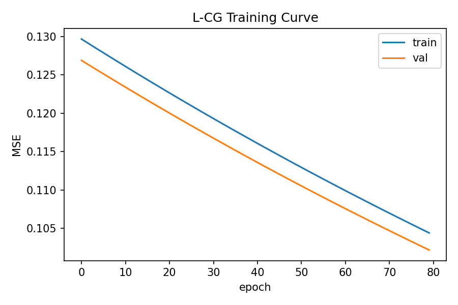

# Phase 4 L-CG v1.1 Summary

## Dataset
- Samples: 216000
- Train/Val/Test: 151200 / 32400 / 32400
- Features: [r, x, v, r_feasible_prev, dist_scale, sat_prev]
- Targets: [log_dr_max, A_scale]

## DAgger-lite
- Iterations: 1
- DAgger samples: 108000

## Training
- Test RMSE log_dr_max: 2.23670
- Test RMSE A_scale: 0.51107
- Training curve: 

## Closed-loop Evaluation (vs CG-v1)
| test | dist_scale | policy | sat_total | RMSE | recovery | mean|e| | %time(|e|<eps) |
|---|---:|---|---:|---:|---:|---:|---:|
| step | 0.15 | baseline | 9.40% | 0.1295 | 1.2700 | 0.0531 | 90.05% |
| ramp_fast | 0.15 | baseline | 0.75% | 0.0404 | 0.0000 | 0.0319 | 90.25% |
| ramp_med | 0.15 | baseline | 0.00% | 0.0248 | 0.0000 | 0.0244 | 100.00% |
| step | 0.15 | cg_v1 | 4.95% | 0.0471 | 2.0100 | 0.0338 | 90.85% |
| ramp_fast | 0.15 | cg_v1 | 0.75% | 0.0404 | 0.0000 | 0.0319 | 90.25% |
| ramp_med | 0.15 | cg_v1 | 0.00% | 0.0248 | 0.0000 | 0.0244 | 100.00% |
| step | 0.15 | lcg_v1_1 | 4.00% | 0.0351 | 0.7300 | 0.0279 | 96.80% |
| ramp_fast | 0.15 | lcg_v1_1 | 0.00% | 0.0244 | 0.0000 | 0.0239 | 100.00% |
| ramp_med | 0.15 | lcg_v1_1 | 0.00% | 0.0211 | 0.0000 | 0.0191 | 100.00% |
| step | 0.25 | baseline | 18.85% | 0.1414 | 1.1300 | 0.0816 | 80.75% |
| ramp_fast | 0.25 | baseline | 8.70% | 0.0510 | 0.0000 | 0.0471 | 83.95% |
| ramp_med | 0.25 | baseline | 2.30% | 0.0353 | 0.0000 | 0.0324 | 100.00% |
| step | 0.25 | cg_v1 | 13.85% | 0.0712 | 1.5800 | 0.0576 | 81.20% |
| ramp_fast | 0.25 | cg_v1 | 8.70% | 0.0510 | 0.0000 | 0.0471 | 83.95% |
| ramp_med | 0.25 | cg_v1 | 2.30% | 0.0353 | 0.0000 | 0.0324 | 100.00% |
| step | 0.25 | lcg_v1_1 | 11.70% | 0.0566 | 0.6600 | 0.0491 | 87.65% |
| ramp_fast | 0.25 | lcg_v1_1 | 2.30% | 0.0386 | 0.0000 | 0.0370 | 100.00% |
| ramp_med | 0.25 | lcg_v1_1 | 1.65% | 0.0366 | 0.0000 | 0.0352 | 100.00% |
| step | 0.35 | baseline | 97.85% | 0.8888 | inf | 0.7783 | 4.05% |
| ramp_fast | 0.35 | baseline | 92.10% | 0.7727 | 0.6600 | 0.6299 | 6.80% |
| ramp_med | 0.35 | baseline | 96.65% | 0.6738 | 4.0500 | 0.4926 | 9.70% |
| step | 0.35 | cg_v1 | 98.50% | 0.9033 | inf | 0.7355 | 3.15% |
| ramp_fast | 0.35 | cg_v1 | 98.50% | 0.9035 | inf | 0.7358 | 3.15% |
| ramp_med | 0.35 | cg_v1 | 98.50% | 0.9035 | inf | 0.7358 | 3.15% |
| step | 0.35 | lcg_v1_1 | 97.35% | 0.7839 | 0.2500 | 0.6553 | 6.10% |
| ramp_fast | 0.35 | lcg_v1_1 | 98.45% | 0.7532 | inf | 0.6182 | 3.20% |
| ramp_med | 0.35 | lcg_v1_1 | 98.45% | 0.7614 | inf | 0.6407 | 3.20% |
| sine_A0.25_f0.1 | 0.15 | baseline | 0.00% | 0.0451 | inf | 0.0378 | 66.35% |
| sine_A0.25_f0.1 | 0.15 | cg_v1 | 0.00% | 0.0451 | inf | 0.0378 | 66.35% |
| sine_A0.25_f0.1 | 0.15 | lcg_v1_1 | 0.00% | 0.0285 | inf | 0.0242 | 100.00% |
| sine_A0.25_f0.2 | 0.15 | baseline | 0.00% | 0.0810 | inf | 0.0712 | 31.60% |
| sine_A0.25_f0.2 | 0.15 | cg_v1 | 0.00% | 0.0810 | inf | 0.0712 | 31.60% |
| sine_A0.25_f0.2 | 0.15 | lcg_v1_1 | 0.00% | 0.0387 | inf | 0.0316 | 71.25% |
| sine_A0.25_f0.3 | 0.15 | baseline | 44.40% | 0.1603 | inf | 0.1357 | 17.50% |
| sine_A0.25_f0.3 | 0.15 | cg_v1 | 21.75% | 0.0934 | inf | 0.0844 | 16.40% |
| sine_A0.25_f0.3 | 0.15 | lcg_v1_1 | 0.00% | 0.0510 | inf | 0.0433 | 63.35% |
| sine_A0.25_f0.5 | 0.15 | baseline | 84.90% | 0.2782 | inf | 0.2296 | 11.80% |
| sine_A0.25_f0.5 | 0.15 | cg_v1 | 34.10% | 0.0714 | inf | 0.0646 | 28.10% |
| sine_A0.25_f0.5 | 0.15 | lcg_v1_1 | 39.20% | 0.0873 | inf | 0.0741 | 34.30% |
| sine_A0.25_f1.0 | 0.15 | baseline | 83.90% | 0.2561 | inf | 0.2087 | 15.80% |
| sine_A0.25_f1.0 | 0.15 | cg_v1 | 29.75% | 0.0624 | inf | 0.0556 | 43.55% |
| sine_A0.25_f1.0 | 0.15 | lcg_v1_1 | 55.50% | 0.1069 | inf | 0.0880 | 36.10% |
| sine_A0.5_f0.1 | 0.15 | baseline | 0.00% | 0.0817 | inf | 0.0718 | 31.50% |
| sine_A0.5_f0.1 | 0.15 | cg_v1 | 0.00% | 0.0817 | inf | 0.0718 | 31.50% |
| sine_A0.5_f0.1 | 0.15 | lcg_v1_1 | 0.00% | 0.0388 | inf | 0.0317 | 71.20% |
| sine_A0.5_f0.2 | 0.15 | baseline | 47.85% | 0.2411 | inf | 0.2021 | 11.75% |
| sine_A0.5_f0.2 | 0.15 | cg_v1 | 25.40% | 0.1376 | inf | 0.1203 | 15.10% |
| sine_A0.5_f0.2 | 0.15 | lcg_v1_1 | 0.00% | 0.0659 | inf | 0.0573 | 42.55% |
| sine_A0.5_f0.3 | 0.15 | baseline | 92.20% | 0.5287 | inf | 0.4391 | 5.90% |
| sine_A0.5_f0.3 | 0.15 | cg_v1 | 38.05% | 0.1112 | inf | 0.1000 | 13.10% |
| sine_A0.5_f0.3 | 0.15 | lcg_v1_1 | 32.90% | 0.1064 | inf | 0.0919 | 25.10% |
| sine_A0.5_f0.5 | 0.15 | baseline | 92.85% | 0.5329 | inf | 0.4359 | 6.75% |
| sine_A0.5_f0.5 | 0.15 | cg_v1 | 35.45% | 0.0845 | inf | 0.0727 | 31.60% |
| sine_A0.5_f0.5 | 0.15 | lcg_v1_1 | 79.00% | 0.2194 | inf | 0.1822 | 14.70% |
| sine_A0.5_f1.0 | 0.15 | baseline | 91.95% | 0.4941 | inf | 0.4012 | 8.10% |
| sine_A0.5_f1.0 | 0.15 | cg_v1 | 30.70% | 0.0645 | inf | 0.0579 | 41.25% |
| sine_A0.5_f1.0 | 0.15 | lcg_v1_1 | 78.65% | 0.1702 | inf | 0.1405 | 21.55% |
| sine_A0.75_f0.1 | 0.15 | baseline | 0.00% | 0.1222 | inf | 0.1085 | 19.80% |
| sine_A0.75_f0.1 | 0.15 | cg_v1 | 0.00% | 0.1222 | inf | 0.1085 | 19.80% |
| sine_A0.75_f0.1 | 0.15 | lcg_v1_1 | 0.00% | 0.0519 | inf | 0.0442 | 63.10% |
| sine_A0.75_f0.2 | 0.15 | baseline | 92.85% | 0.6304 | inf | 0.5296 | 4.70% |
| sine_A0.75_f0.2 | 0.15 | cg_v1 | 35.15% | 0.1385 | inf | 0.1224 | 13.80% |
| sine_A0.75_f0.2 | 0.15 | lcg_v1_1 | 0.00% | 0.0965 | inf | 0.0855 | 25.20% |
| sine_A0.75_f0.3 | 0.15 | baseline | 95.40% | 0.7973 | inf | 0.6564 | 4.10% |
| sine_A0.75_f0.3 | 0.15 | cg_v1 | 41.10% | 0.1194 | inf | 0.1064 | 13.35% |
| sine_A0.75_f0.3 | 0.15 | lcg_v1_1 | 66.35% | 0.2258 | inf | 0.1895 | 13.00% |
| sine_A0.75_f0.5 | 0.15 | baseline | 94.95% | 0.7646 | inf | 0.6247 | 4.75% |
| sine_A0.75_f0.5 | 0.15 | cg_v1 | 35.80% | 0.0906 | inf | 0.0765 | 33.10% |
| sine_A0.75_f0.5 | 0.15 | lcg_v1_1 | 87.85% | 0.3265 | inf | 0.2689 | 10.20% |
| sine_A0.75_f1.0 | 0.15 | baseline | 94.35% | 0.7243 | inf | 0.5885 | 5.45% |
| sine_A0.75_f1.0 | 0.15 | cg_v1 | 30.85% | 0.0647 | inf | 0.0582 | 41.25% |
| sine_A0.75_f1.0 | 0.15 | lcg_v1_1 | 79.05% | 0.1735 | inf | 0.1436 | 20.25% |
| sine_A0.25_f0.1 | 0.25 | baseline | 3.60% | 0.0560 | inf | 0.0448 | 56.25% |
| sine_A0.25_f0.1 | 0.25 | cg_v1 | 2.35% | 0.0557 | inf | 0.0447 | 56.25% |
| sine_A0.25_f0.1 | 0.25 | lcg_v1_1 | 2.60% | 0.0435 | inf | 0.0403 | 65.15% |
| sine_A0.25_f0.2 | 0.25 | baseline | 50.40% | 0.1404 | inf | 0.1101 | 29.45% |
| sine_A0.25_f0.2 | 0.25 | cg_v1 | 21.35% | 0.0800 | inf | 0.0713 | 26.55% |
| sine_A0.25_f0.2 | 0.25 | lcg_v1_1 | 2.45% | 0.0506 | inf | 0.0409 | 57.60% |
| sine_A0.25_f0.3 | 0.25 | baseline | 73.45% | 0.2910 | inf | 0.2322 | 15.55% |
| sine_A0.25_f0.3 | 0.25 | cg_v1 | 55.35% | 0.1007 | inf | 0.0894 | 22.55% |
| sine_A0.25_f0.3 | 0.25 | lcg_v1_1 | 40.05% | 0.0719 | inf | 0.0564 | 53.55% |
| sine_A0.25_f0.5 | 0.25 | baseline | 81.45% | 0.3256 | inf | 0.2668 | 8.25% |
| sine_A0.25_f0.5 | 0.25 | cg_v1 | 59.35% | 0.1464 | inf | 0.1282 | 12.40% |
| sine_A0.25_f0.5 | 0.25 | lcg_v1_1 | 66.10% | 0.1339 | inf | 0.1069 | 37.40% |
| sine_A0.25_f1.0 | 0.25 | baseline | 81.30% | 0.3128 | inf | 0.2565 | 18.30% |
| sine_A0.25_f1.0 | 0.25 | cg_v1 | 42.40% | 0.0753 | inf | 0.0634 | 37.00% |
| sine_A0.25_f1.0 | 0.25 | lcg_v1_1 | 68.55% | 0.1330 | inf | 0.1089 | 30.75% |
| sine_A0.5_f0.1 | 0.25 | baseline | 24.00% | 0.0921 | inf | 0.0775 | 33.75% |
| sine_A0.5_f0.1 | 0.25 | cg_v1 | 7.30% | 0.0862 | inf | 0.0743 | 32.45% |
| sine_A0.5_f0.1 | 0.25 | lcg_v1_1 | 3.30% | 0.0510 | inf | 0.0411 | 57.80% |
| sine_A0.5_f0.2 | 0.25 | baseline | 76.10% | 0.4777 | inf | 0.3774 | 9.30% |
| sine_A0.5_f0.2 | 0.25 | cg_v1 | 55.30% | 0.1560 | inf | 0.1337 | 13.60% |
| sine_A0.5_f0.2 | 0.25 | lcg_v1_1 | 40.05% | 0.0896 | inf | 0.0713 | 52.65% |
| sine_A0.5_f0.3 | 0.25 | baseline | 85.40% | 0.6155 | inf | 0.4867 | 9.30% |
| sine_A0.5_f0.3 | 0.25 | cg_v1 | 61.30% | 0.1573 | inf | 0.1317 | 21.50% |
| sine_A0.5_f0.3 | 0.25 | lcg_v1_1 | 68.35% | 0.2165 | inf | 0.1721 | 20.55% |
| sine_A0.5_f0.5 | 0.25 | baseline | 91.40% | 0.6265 | inf | 0.5146 | 7.65% |
| sine_A0.5_f0.5 | 0.25 | cg_v1 | 63.15% | 0.1653 | inf | 0.1432 | 11.85% |
| sine_A0.5_f0.5 | 0.25 | lcg_v1_1 | 73.40% | 0.2603 | inf | 0.2100 | 16.85% |
| sine_A0.5_f1.0 | 0.25 | baseline | 86.15% | 0.5811 | inf | 0.4703 | 13.65% |
| sine_A0.5_f1.0 | 0.25 | cg_v1 | 41.45% | 0.0751 | inf | 0.0619 | 40.75% |
| sine_A0.5_f1.0 | 0.25 | lcg_v1_1 | 79.00% | 0.2196 | inf | 0.1838 | 18.30% |
| sine_A0.75_f0.1 | 0.25 | baseline | 49.70% | 0.2322 | inf | 0.1783 | 16.95% |
| sine_A0.75_f0.1 | 0.25 | cg_v1 | 12.30% | 0.1104 | inf | 0.1021 | 14.05% |
| sine_A0.75_f0.1 | 0.25 | lcg_v1_1 | 3.95% | 0.0618 | inf | 0.0500 | 55.10% |
| sine_A0.75_f0.2 | 0.25 | baseline | 88.85% | 0.8213 | inf | 0.6476 | 5.50% |
| sine_A0.75_f0.2 | 0.25 | cg_v1 | 59.95% | 0.2020 | inf | 0.1689 | 12.95% |
| sine_A0.75_f0.2 | 0.25 | lcg_v1_1 | 56.80% | 0.2002 | inf | 0.1560 | 20.60% |
| sine_A0.75_f0.3 | 0.25 | baseline | 92.25% | 0.8983 | inf | 0.7160 | 5.30% |
| sine_A0.75_f0.3 | 0.25 | cg_v1 | 63.15% | 0.2274 | inf | 0.1902 | 13.10% |
| sine_A0.75_f0.3 | 0.25 | lcg_v1_1 | 75.90% | 0.3600 | inf | 0.2868 | 13.05% |
| sine_A0.75_f0.5 | 0.25 | baseline | 93.00% | 0.8634 | inf | 0.7009 | 6.75% |
| sine_A0.75_f0.5 | 0.25 | cg_v1 | 59.85% | 0.1671 | inf | 0.1341 | 20.15% |
| sine_A0.75_f0.5 | 0.25 | lcg_v1_1 | 87.00% | 0.3873 | inf | 0.3207 | 7.55% |
| sine_A0.75_f1.0 | 0.25 | baseline | 90.45% | 0.8488 | inf | 0.6843 | 9.95% |
| sine_A0.75_f1.0 | 0.25 | cg_v1 | 43.40% | 0.0779 | inf | 0.0648 | 37.00% |
| sine_A0.75_f1.0 | 0.25 | lcg_v1_1 | 79.65% | 0.2292 | inf | 0.1915 | 18.35% |
| sine_A0.25_f0.1 | 0.35 | baseline | 97.00% | 0.8134 | inf | 0.7093 | 9.55% |
| sine_A0.25_f0.1 | 0.35 | cg_v1 | 97.00% | 0.8621 | inf | 0.7478 | 6.70% |
| sine_A0.25_f0.1 | 0.35 | lcg_v1_1 | 98.10% | 0.8123 | inf | 0.7151 | 4.65% |
| sine_A0.25_f0.2 | 0.35 | baseline | 95.90% | 0.8661 | inf | 0.7500 | 7.15% |
| sine_A0.25_f0.2 | 0.35 | cg_v1 | 95.90% | 0.8939 | inf | 0.7942 | 6.85% |
| sine_A0.25_f0.2 | 0.35 | lcg_v1_1 | 97.60% | 0.8148 | inf | 0.7185 | 5.85% |
| sine_A0.25_f0.3 | 0.35 | baseline | 93.10% | 0.9655 | inf | 0.8606 | 3.60% |
| sine_A0.25_f0.3 | 0.35 | cg_v1 | 96.40% | 0.9308 | inf | 0.8342 | 3.10% |
| sine_A0.25_f0.3 | 0.35 | lcg_v1_1 | 97.15% | 0.8416 | inf | 0.7472 | 5.80% |
| sine_A0.25_f0.5 | 0.35 | baseline | 97.15% | 1.1302 | inf | 1.0429 | 1.30% |
| sine_A0.25_f0.5 | 0.35 | cg_v1 | 96.95% | 1.0029 | inf | 0.9108 | 1.95% |
| sine_A0.25_f0.5 | 0.35 | lcg_v1_1 | 97.20% | 0.9428 | inf | 0.8523 | 4.00% |
| sine_A0.25_f1.0 | 0.35 | baseline | 97.80% | 1.1533 | inf | 1.0627 | 0.70% |
| sine_A0.25_f1.0 | 0.35 | cg_v1 | 98.05% | 1.0088 | inf | 0.9194 | 1.85% |
| sine_A0.25_f1.0 | 0.35 | lcg_v1_1 | 97.95% | 0.8985 | inf | 0.8155 | 1.80% |
| sine_A0.5_f0.1 | 0.35 | baseline | 92.85% | 0.9274 | inf | 0.7549 | 9.50% |
| sine_A0.5_f0.1 | 0.35 | cg_v1 | 92.80% | 0.8702 | inf | 0.7537 | 8.30% |
| sine_A0.5_f0.1 | 0.35 | lcg_v1_1 | 97.55% | 0.8080 | inf | 0.7084 | 7.85% |
| sine_A0.5_f0.2 | 0.35 | baseline | 90.00% | 1.1582 | inf | 0.9747 | 6.70% |
| sine_A0.5_f0.2 | 0.35 | cg_v1 | 94.95% | 0.9444 | inf | 0.8433 | 2.55% |
| sine_A0.5_f0.2 | 0.35 | lcg_v1_1 | 96.35% | 0.8408 | inf | 0.7368 | 7.05% |
| sine_A0.5_f0.3 | 0.35 | baseline | 94.15% | 1.3470 | inf | 1.2135 | 1.55% |
| sine_A0.5_f0.3 | 0.35 | cg_v1 | 95.80% | 1.0114 | inf | 0.9079 | 1.90% |
| sine_A0.5_f0.3 | 0.35 | lcg_v1_1 | 96.20% | 0.9083 | inf | 0.8086 | 5.40% |
| sine_A0.5_f0.5 | 0.35 | baseline | 99.10% | 1.3214 | inf | 1.1954 | 0.70% |
| sine_A0.5_f0.5 | 0.35 | cg_v1 | 96.60% | 1.0764 | inf | 0.9763 | 1.55% |
| sine_A0.5_f0.5 | 0.35 | lcg_v1_1 | 97.20% | 1.0778 | inf | 0.9912 | 1.70% |
| sine_A0.5_f1.0 | 0.35 | baseline | 98.65% | 1.2552 | inf | 1.1356 | 1.65% |
| sine_A0.5_f1.0 | 0.35 | cg_v1 | 97.60% | 1.0183 | inf | 0.9277 | 1.75% |
| sine_A0.5_f1.0 | 0.35 | lcg_v1_1 | 95.45% | 1.0598 | inf | 0.9737 | 1.10% |
| sine_A0.75_f0.1 | 0.35 | baseline | 88.50% | 1.1253 | inf | 0.8264 | 11.45% |
| sine_A0.75_f0.1 | 0.35 | cg_v1 | 91.50% | 0.8810 | inf | 0.7684 | 4.20% |
| sine_A0.75_f0.1 | 0.35 | lcg_v1_1 | 96.00% | 0.8253 | inf | 0.7141 | 10.65% |
| sine_A0.75_f0.2 | 0.35 | baseline | 87.05% | 1.4753 | inf | 1.2463 | 2.10% |
| sine_A0.75_f0.2 | 0.35 | cg_v1 | 94.80% | 0.9819 | inf | 0.8766 | 2.00% |
| sine_A0.75_f0.2 | 0.35 | lcg_v1_1 | 95.70% | 0.8965 | inf | 0.7629 | 4.75% |
| sine_A0.75_f0.3 | 0.35 | baseline | 98.60% | 1.6492 | inf | 1.4881 | 0.85% |
| sine_A0.75_f0.3 | 0.35 | cg_v1 | 95.45% | 1.0763 | inf | 0.9628 | 1.65% |
| sine_A0.75_f0.3 | 0.35 | lcg_v1_1 | 92.10% | 1.0465 | inf | 0.9362 | 2.85% |
| sine_A0.75_f0.5 | 0.35 | baseline | 98.35% | 1.5476 | inf | 1.3854 | 1.10% |
| sine_A0.75_f0.5 | 0.35 | cg_v1 | 96.25% | 1.0747 | inf | 0.9718 | 1.60% |
| sine_A0.75_f0.5 | 0.35 | lcg_v1_1 | 97.20% | 1.1755 | inf | 1.0853 | 1.20% |
| sine_A0.75_f1.0 | 0.35 | baseline | 97.95% | 1.4806 | inf | 1.3180 | 0.80% |
| sine_A0.75_f1.0 | 0.35 | cg_v1 | 97.45% | 1.0179 | inf | 0.9277 | 1.70% |
| sine_A0.75_f1.0 | 0.35 | lcg_v1_1 | 95.15% | 1.1023 | inf | 1.0147 | 1.05% |

## Notes
- Teacher searches over (dr_max, A_scale) each step to minimize a one-step surrogate cost.
- L-CG v1.1 predicts log_dr_max and A_scale, clamped to [dr_min, dr_cap] and [A_min, A_max].
- Evaluation compares baseline, CG-v1, and L-CG v1.1 across step/ramp and sine grid.
